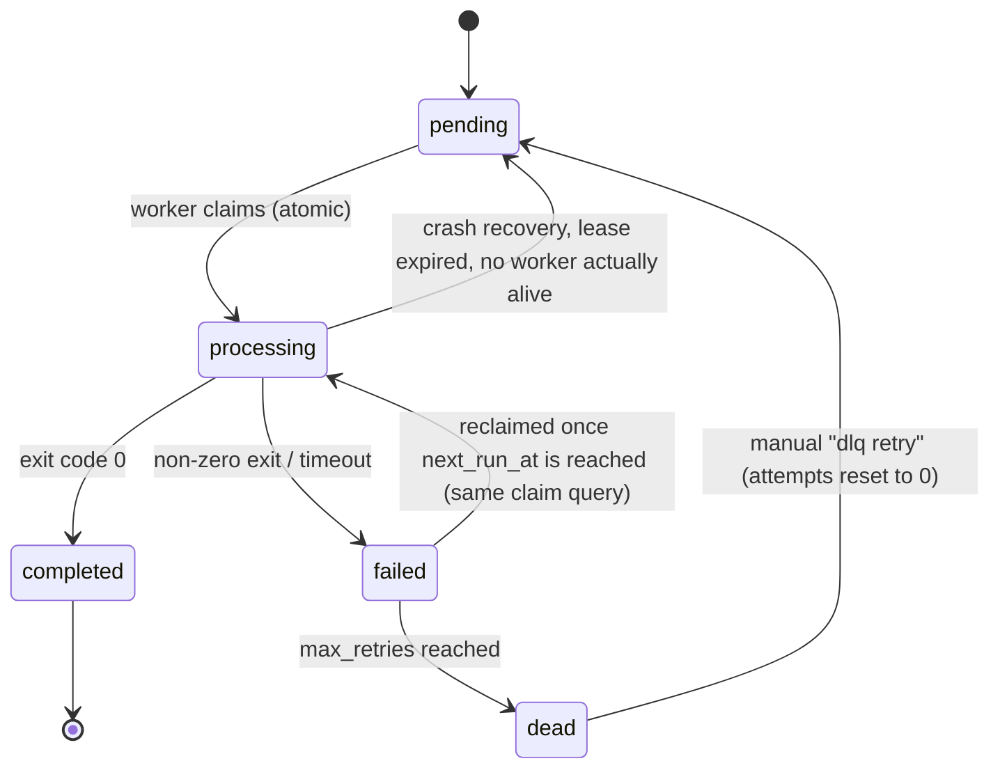

# QueueCTL

A CLI-based background job queue system, built the way production job processors actually work, not a REST API wrapper with a jobs table behind it.

Producers enqueue jobs. Independent worker processes (not threads) claim and execute them concurrently. Failures retry with exponential backoff. Permanently failed jobs land in a Dead Letter Queue. If a worker gets killed mid-job, the job gets reclaimed automatically within about 30 seconds. Everything persists to SQLite and survives both a clean restart and a hard kill.

```bash
queuectl enqueue '{"id":"job1","command":"echo hello"}'
queuectl worker start --count 3
queuectl status
```

---

## Table of Contents

- [Why This Exists](#why-this-exists)
- [Features](#features)
- [Architecture](#architecture)
- [Project Structure](#project-structure)
- [Installation](#installation)
- [CLI Reference](#cli-reference)
- [Job Lifecycle](#job-lifecycle)
- [Concurrency: Atomic Job Claiming](#concurrency-atomic-job-claiming)
- [Crash Recovery](#crash-recovery)
- [Retry & Exponential Backoff](#retry--exponential-backoff)
- [Dead Letter Queue](#dead-letter-queue)
- [Priority Queue](#priority-queue)
- [Scheduled Jobs](#scheduled-jobs)
- [Timeout Handling](#timeout-handling)
- [Graceful Shutdown, Cross-Process](#graceful-shutdown-cross-process)
- [Logs & Metrics](#logs--metrics)
- [Monitoring Dashboard](#monitoring-dashboard)
- [Configuration](#configuration)
- [Testing](#testing)
- [Design Decisions (Summary)](#design-decisions-summary)
- [Known Limitations](#known-limitations)
- [Demo](#demo)
- [License](#license)

---

## Why This Exists

Most take-home assignments in this space turn into a REST API sitting on top of a jobs table. I wanted to avoid that and build something closer to how background job systems actually run in production: a producer/consumer model over a durable store, with workers as real OS processes instead of in-process callbacks.

The priority while building this was getting the core primitives right first: atomic claiming, crash recovery, backoff, DLQ, cross-process shutdown. Everything else got added on top of that once those were solid.

## Features

### Core

| Feature | Description |
|---|---|
| CLI queue management | Full lifecycle control via `commander.js` |
| Persistent storage | SQLite (`better-sqlite3`), survives restarts |
| Concurrent workers | Multiple OS processes, atomic claim means no duplicate execution |
| Crash recovery | Lease-based. A `SIGKILL`ed worker's job gets reclaimed automatically, worst case around 31 seconds |
| Command execution | Jobs run as real OS commands via `child_process` |
| Automatic retries | Exponential backoff, configurable base and a per-job retry ceiling |
| Dead Letter Queue | Permanently failed jobs isolated and manually re-queueable |
| Cross-process worker stop | `worker stop` signals workers running in another terminal through a DB-backed registry, no OS signals involved |
| Runtime configuration | `max-retries`, `backoff-base` stored in SQLite instead of hardcoded |
| Machine-readable output | `list --json` for scripting or automated tests |

### Bonus

| Feature | Description |
|---|---|
| Job priority | `priority DESC, created_at ASC`, higher priority runs first, FIFO within a tier |
| Scheduled / delayed jobs | `--run-at` sets an execution floor via `next_run_at` |
| Timeout handling | Long-running jobs get killed and routed into the retry path |
| Output/error logging | Per-job stdout/stderr captured and queryable, plus structured retry logging |
| Metrics | Success rate, average attempts, per-state counts |
| Read-only dashboard | Live Express UI over the same service layer, CLI stays the only write path |

## Architecture

QueueCTL is layered so each piece has exactly one job. Nothing above the Repository layer touches SQLite directly, and nothing below the Service layer makes a decision.


**CLI layer.** Parses commands, validates argument shape, formats output. No business logic lives here.

**Service layer.** Owns queue operations, retry/backoff policy, metrics, config validation. No raw SQL.

**Repository layer.** SQL and transactions only. `jobRepository`, `configRepository`, and `workerRepository` each own one table and don't make decisions about what's valid or retryable.

**Worker layer.** `WorkerManager` owns process lifecycle. `Worker` polls and drives the claim, execute, complete/fail loop. `Executor` wraps `child_process`, handling stdout/stderr capture and timeout kills.

**Dashboard.** Reads through the same Service layer the CLI uses, so the numbers you see in `queuectl metrics` and on the web page can never drift apart. There's no write path at all.

## Project Structure

```
src/
├── cli/
│   ├── index.js               # command definitions, wiring, arg parsing
│   └── parseJobPayload.js     # JSON + PowerShell + flag-based payload parsing
├── database/
│   ├── connection.js
│   └── init.js                 # schema creation + additive migrations
├── repositories/
│   ├── jobRepository.js        # jobs table: claim, retry, crash recovery
│   ├── configRepository.js     # config table
│   └── workerRepository.js     # workers table (registry)
├── services/
│   ├── queueService.js
│   ├── configService.js
│   ├── logService.js
│   ├── metricsService.js
│   └── workerService.js
├── workers/
│   ├── executor.js
│   ├── worker.js
│   └── workerManager.js
└── dashboard/
    ├── server.js
    └── public/
        ├── index.html
        ├── style.css
        └── app.js

tests/        # 12 suites, ~90 tests, repositories, services, workers, CLI, dashboard
docs/
```

## Installation

Needs **Node.js 18+** (`better-sqlite3@^12` requires it).

```bash
git clone https://github.com/Bhumica-jaiswal/QueueCTL.git
cd QueueCTL
npm install
```

Run it through the npm script:

```bash
npm run queuectl -- --help
```

Or link it globally if you want a shorter command:

```bash
npm link
queuectl --help
```

The SQLite database (`queuectl.db`) and its schema get created automatically the first time you run anything. No manual migration step.

## CLI Reference

| Category | Command | Description |
|---|---|---|
| Enqueue | `queuectl enqueue '{"id":"job1","command":"echo hi"}'` | Add a job from JSON |
| Enqueue | `queuectl enqueue --id job1 --command "echo hi" [--priority N] [--timeout SEC] [--run-at ISO_TS] [--max-retries N]` | Add a job from flags (PowerShell-safe) |
| Workers | `queuectl worker start --count 3` | Start N workers in the **foreground** (blocks) |
| Workers | `queuectl worker stop` | Gracefully stop all running workers, from a **different terminal** |
| Status | `queuectl status` | State counts + active worker count |
| List | `queuectl list [--state <state>] [--json]` | List jobs, optionally filtered. `--json` prints a pure JSON array |
| Logs | `queuectl logs <jobId>` | Show stored stdout/stderr for a job |
| Metrics | `queuectl metrics` | Totals, success rate, average attempts |
| DLQ | `queuectl dlq list` | List dead jobs |
| DLQ | `queuectl dlq retry <jobId>` | Re-enqueue a dead job (resets attempts) |
| Config | `queuectl config set <key> <value>` | Set `max-retries` or `backoff-base` |
| Dashboard | `queuectl dashboard [--port 3000]` | Start the read-only monitoring UI |

### Enqueueing

Standard JSON, works fine on macOS/Linux:

```bash
queuectl enqueue '{"id":"job1","command":"echo hello"}'
```

Flag-based, which exists because raw JSON gets mangled by PowerShell's quoting. `parseJobPayload.js` also auto-repairs the PowerShell-stripped-quotes case when you pass raw JSON to `enqueue` directly, so both paths work either way:

```bash
queuectl enqueue --id job1 --command "echo hello" --priority 5 --timeout 30
```

Validation happens in the service layer no matter which input path you used. Missing `id`, missing `command`, duplicate `id`, negative `max_retries`, a non-integer `priority`, a non-positive `timeout`, all of these get rejected with a specific error message instead of failing silently somewhere downstream.

### Starting workers

```bash
queuectl worker start --count 3
```

Each worker here is a logical unit inside one Node process, not one OS process per worker. But if you run `worker start` from a few separate terminals, you get genuinely separate OS processes coordinating through the same SQLite file, and that's the actual scenario the atomic claim has to defend against.

## Job Lifecycle



Two things worth calling out here, since they're easy to get wrong if you're describing this from memory in the review:

- A `failed` job doesn't get re-queued as `pending`. It just stays `failed` with `next_run_at` set to the backoff deadline. The same claim query that picks up `pending` jobs also picks up `failed` jobs once their `next_run_at` has passed. There's no separate "resume" path.
- `processing → pending` only happens through crash recovery, when a job's lease has expired because whatever worker claimed it is gone. That's different from a normal retry, more on that below.

## Concurrency: Atomic Job Claiming

The claim happens inside a single transaction in `jobRepository.claimNextJob()`, run in SQLite's `IMMEDIATE` mode (`db.transaction(fn).immediate(...)` in `better-sqlite3`):

```js
const claimNextJobTransaction = db.transaction((workerId, now) => {
  recoverStaleJobs(now);                       // reclaim expired leases first

  const next = findNextClaimableStatement.get(now, now);
  // WHERE (state='pending' AND next_run_at<=?) OR (state='failed' AND next_run_at<=?)
  // ORDER BY priority DESC, created_at ASC LIMIT 1
  if (!next) return null;

  const result = markClaimedStatement.run(String(workerId), now, now, next.id);
  // UPDATE jobs SET state='processing', worker_id=?, processing_started_at=?
  // WHERE id=? AND state IN ('pending','failed')
  if (result.changes === 0) return null;        // someone else claimed it first

  return findByIdStatement.get(next.id);
});
```

Why this actually holds up across separate OS processes and not just inside one: starting the transaction in `IMMEDIATE` mode makes SQLite grab a `RESERVED` lock on the database file itself before either statement runs. That's enforced by SQLite's own file locking, so it applies no matter which process opened the connection. A second worker process trying its own claim transaction at the same time either waits for the first to commit, or gets serialized by SQLite's single-writer rule if you're in WAL mode. Either way, only one transaction's `UPDATE ... WHERE state IN ('pending','failed')` can actually match a given row. By the time a second transaction's `SELECT` runs, that job is already gone from the claimable pool.

An in-process mutex or a `Set` of claimed IDs wouldn't have solved this. It only protects one Node process, and the assignment specifically requires workers started from separate terminal sessions (separate OS processes) to never double-claim a job.

## Crash Recovery

If a worker gets `SIGKILL`ed mid-job, the job it was running is left with `state='processing'` and a `processing_started_at` timestamp, but nothing is actually working on it anymore. There's no cleanup handler that fires for `SIGKILL`, so nothing tells the database the job is orphaned.

Recovery here is lease-based, not heartbeat-based. Every claim attempt, from any worker, runs `recoverStaleJobs()` first, inside the same transaction as the claim itself:

```sql
UPDATE jobs
SET state = 'pending', worker_id = NULL, processing_started_at = NULL, updated_at = ?
WHERE state = 'processing' AND processing_started_at < ?   -- older than the lease (30s)
```

This resets any job whose lease has expired back to `pending`. `attempts` isn't touched, so the job doesn't lose its retry history, and it becomes claimable by any worker (not necessarily a new one) on the next poll.

Worst case recovery time is the lease duration (`PROCESSING_LEASE_MS = 30_000`) plus at most one poll interval, since workers poll every second. That works out to about 31 seconds, under the assignment's 60-second bound.

This trades a bounded delay for not having to run anything extra: no heartbeat thread, no separate liveness table, no additional writes per second per worker. The cost is that a crashed job can genuinely look stuck in `processing` for up to 30 seconds before the system notices. That's a trade-off I made on purpose, not something I missed.

## Retry & Exponential Backoff

```
delay = backoff_base ^ attempts   (seconds, attempts = completed attempts after this failure)
```

With `backoff_base = 2` (the default):

| Completed attempts | Retry delay |
|---|---|
| 1 | 2s |
| 2 | 4s |
| 3 | 8s |

Once `attempts >= max_retries`, the job moves to `dead` instead of scheduling another retry, and stops being claimable.

`backoff-base` is read from the config table at the moment of failure, not baked into the job when it's enqueued, so changing it with `config set backoff-base` changes the delay for the next retry of every job currently sitting in `failed`, not just newly enqueued ones. `max_retries` works differently: it's captured on the job row at enqueue time (or set explicitly per-job with `--max-retries`), so a later `config set max-retries` only affects jobs enqueued after the change.

## Dead Letter Queue

```bash
queuectl dlq list
queuectl dlq retry job1
```

`dlq retry` resets `attempts` to `0`, clears `error`, and sets `state` back to `pending`. I treat this as a fresh retry budget, since a manual retry means someone looked at the job and decided the underlying problem is fixed, so it shouldn't die on the very next failure with zero attempts left.

## Priority Queue

```bash
queuectl enqueue --id urgent --command "echo important" --priority 10
```

Claim order:

```sql
ORDER BY priority DESC, created_at ASC
```

Higher priority runs first, equal priority falls back to FIFO by creation time. Default priority is `0`.

## Scheduled Jobs

```bash
queuectl enqueue --id future-job --command "echo later" --run-at "2026-07-13T10:00:00Z"
```

Implemented by reusing `next_run_at` as a single "don't claim before this time" field rather than building a separate scheduler. Normal jobs get `next_run_at = now`, scheduled jobs get `next_run_at = run_at`, and retries push `next_run_at` forward by the backoff delay. One field, one `WHERE next_run_at <= now` clause in the claim query, one code path for all three cases.

## Timeout Handling

```bash
queuectl enqueue --id slow-job --command "sleep 60" --timeout 5
```

The executor starts a timer alongside the spawned process. If it fires before the process exits, the child gets killed and the result comes back as a failure (`"Job timed out after N seconds"`), which flows through the normal retry/DLQ path. There's no separate timeout-specific state, it just reuses the failure pipeline.

## Graceful Shutdown, Cross-Process

There are two separate shutdown paths here.

**Same-process (`Ctrl+C` / `SIGTERM`), through `WorkerManager`:**
`SIGINT`/`SIGTERM` gets caught once by `waitForShutdownSignal()`, which calls `shutdown()`, which calls each worker's `stop()`, which finishes any in-flight job before the process exits.

**Cross-process (`queuectl worker stop`, run from another terminal), through the `workers` DB registry:**

```
worker start  → INSERT/UPSERT into `workers` (status='running')
worker stop   → UPDATE workers SET status='stopping' WHERE status='running'
worker loop   → checks its own row's status at the top of every poll cycle
              → sees 'stopping' → finishes current job → deletes its row → exits
```

No PID files, sockets, or OS signals for the cross-process case. The workers table these processes already share for everything else does double duty as the coordination channel. See [DECISIONS.md](DECISIONS.md) for the alternatives I considered and rejected here.

## Logs & Metrics

```bash
queuectl logs job1
```
```
Job: job1
State: completed
Attempts: 0
Output: hello
Error: None
```

```bash
queuectl metrics
```
```
QueueCTL Metrics

Total Jobs: 10
Pending: 0
Processing: 0
Completed: 8
Failed: 1
Dead: 1

Success Rate: 80%
Average Attempts: 1.3
```

## Monitoring Dashboard

```bash
queuectl dashboard
# http://localhost:3000
```

Read-only on purpose: `GET /api/metrics`, `GET /api/jobs`, `GET /api/jobs/:id`, all served through the same `queueService`/`metricsService`/`logService` the CLI uses, so the dashboard can't disagree with `queuectl metrics`. Auto-refreshes every 3 seconds. There's no write endpoint anywhere, every mutation still has to go through the CLI.

**Overview, live metrics and job table:**


**Job detail, command, output, and error inspection:**


## Configuration

```bash
queuectl config set max-retries 5
queuectl config set backoff-base 2
```

Stored in the `config` table, not hardcoded and not read from a startup file, so a change takes effect on the next claim/failure cycle for any currently-running worker without a restart. See [Retry & Exponential Backoff](#retry--exponential-backoff) above for exactly which config changes apply retroactively to already-enqueued jobs and which don't. The two settings behave differently on purpose.

## Testing

```bash
npm test
```

12 suites, roughly 90 tests, covering:

- Repository-level atomic claiming and crash recovery
- Service-level retry/backoff math and DLQ transitions
- Worker execution loop, including simulated failures and timeouts
- CLI argument parsing and `--json` output shape
- Config validation
- Dashboard read endpoints
- Persistence across a simulated restart

Also manually verified against the assignment's required live-test scenarios: a basic job completing, a retry landing in the DLQ, many jobs across multiple concurrent workers with exactly-once execution, a `SIGKILL` mid-job followed by full recovery, and survival of a full process restart.

## Design Decisions (Summary)

Full reasoning, including the two designs I rejected for `worker stop` and the priority-queue trade-off analysis, is in [`DECISIONS.md`](DECISIONS.md).

- **SQLite over a database server.** Zero external infrastructure, transactional, fits a single-machine CLI tool. Trade-off: not distributed, single-writer.
- **Lease-based crash recovery over heartbeats.** No extra background process to run, at the cost of a bounded ~30s worst-case recovery window.
- **DB-registry-based `worker stop` over PID/socket/Redis signaling.** Cross-platform and reuses infrastructure the system already depends on.
- **One `next_run_at` field for both retries and scheduling.** One code path instead of two that could quietly drift apart.

## Known Limitations

Things I scoped out on purpose, not things I missed:

- **Single-machine, not distributed.** Coordination happens entirely through one SQLite file. There's no multi-machine story here, and SQLite's single-writer model would start to bottleneck at a much higher worker count than this is built for.
- **Bounded, not instant, crash recovery.** A crashed job can look stuck in `processing` for up to about 30 seconds before the lease mechanism reclaims it. Deliberate trade-off for simplicity, but it does mean an external caller polling job state can see a temporarily stale `processing` status.
- **Polling, not push.** Workers poll once a second instead of getting notified of new jobs. Simple and predictable, at the cost of up to a second of latency on pickup.
- **No auth on the dashboard.** Built for local/dev use, not meant to be exposed publicly as-is.

## Demo

📹 [Demo video](https://drive.google.com/file/d/1tpi2dn6gVnULLTK8QMMMkNvRCvKndrP1/view?usp=sharing)

## License

ISC, see [LICENSE](LICENSE).

## Author

Built by [Bhumica Jaiswal](https://github.com/Bhumica-jaiswal) for the Flam Backend Developer Internship assignment. Focus was on getting the core queue primitives (atomic claiming, crash recovery, backoff, DLQ, cross-process shutdown) actually correct before adding anything on top of them.