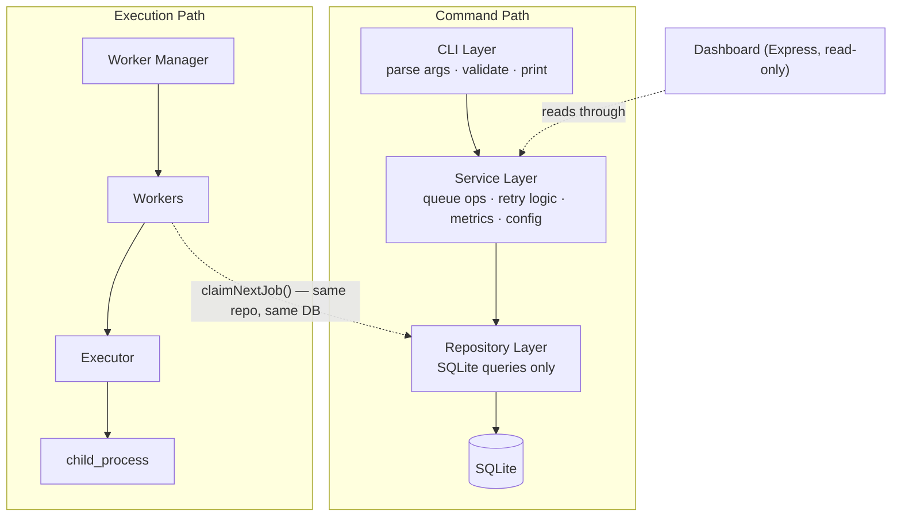
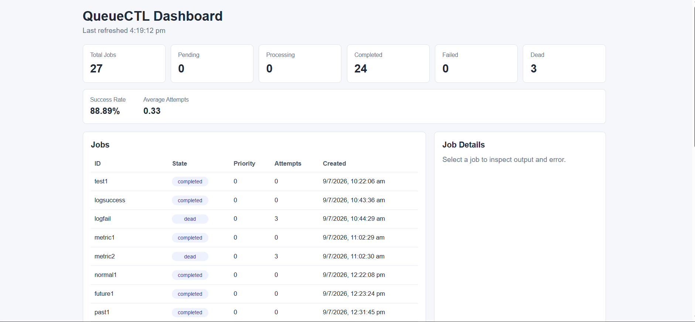
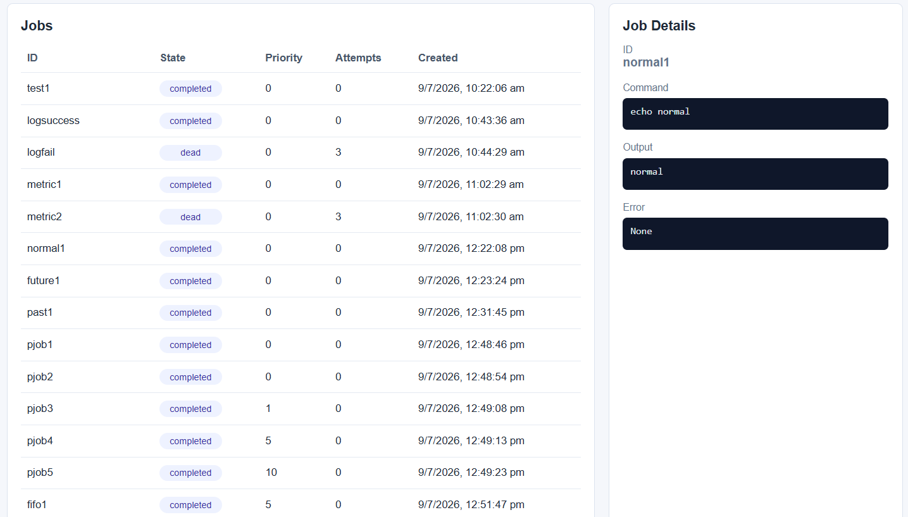

# QueueCTL

A CLI-based background job queue system, built the way production job processors actually work — not a REST API wrapper around a jobs table.

Producers enqueue jobs. Independent worker **processes** (not threads) claim and execute them concurrently. Failures retry with exponential backoff. Permanently failed jobs land in a Dead Letter Queue. A crashed worker's in-flight job is automatically reclaimed within seconds. Everything persists to SQLite and survives both a clean restart and a hard kill.

```bash
queuectl enqueue '{"id":"job1","command":"echo hello"}'
queuectl worker start --count 3
queuectl status
```

---

## Table of Contents

- [Why This Exists](#why-this-exists)
- [Features](#features)
- [Architecture](#architecture)
- [Project Structure](#project-structure)
- [Installation](#installation)
- [CLI Reference](#cli-reference)
- [Job Lifecycle](#job-lifecycle)
- [Concurrency: Atomic Job Claiming](#concurrency-atomic-job-claiming)
- [Crash Recovery](#crash-recovery)
- [Retry & Exponential Backoff](#retry--exponential-backoff)
- [Dead Letter Queue](#dead-letter-queue)
- [Priority Queue](#priority-queue)
- [Scheduled Jobs](#scheduled-jobs)
- [Timeout Handling](#timeout-handling)
- [Graceful Shutdown, Cross-Process](#graceful-shutdown-cross-process)
- [Logs & Metrics](#logs--metrics)
- [Monitoring Dashboard](#monitoring-dashboard)
- [Configuration](#configuration)
- [Testing](#testing)
- [Design Decisions (Summary)](#design-decisions-summary)
- [Known Limitations](#known-limitations)
- [Demo](#demo)
- [License](#license)

---

## Why This Exists

Most take-home assignments in this space become a REST API with a `jobs` table behind it. QueueCTL deliberately doesn't — it mirrors how background job systems actually run in production: a **producer/consumer model** over a durable store, with workers as independent OS processes rather than in-process callbacks or threads.

The priority order while building this was: get the primitives correct first — atomic claiming, crash recovery, backoff, DLQ, cross-process shutdown — before adding anything on top.

## Features

### Core

| Feature | Description |
|---|---|
| CLI queue management | Full lifecycle control via `commander.js` |
| Persistent storage | SQLite (`better-sqlite3`), survives restarts |
| Concurrent workers | Multiple OS processes, atomic claim guarantees no duplicate execution |
| Crash recovery | Lease-based — a `SIGKILL`ed worker's job is reclaimed automatically, worst case ~31s |
| Command execution | Jobs run as real OS commands via `child_process` |
| Automatic retries | Exponential backoff, configurable base and per-job retry ceiling |
| Dead Letter Queue | Permanently failed jobs isolated and manually re-queueable |
| Cross-process worker stop | `worker stop` signals workers in another terminal via a DB-backed registry — no OS signals |
| Runtime configuration | `max-retries`, `backoff-base` stored in SQLite, no hardcoding |
| Machine-readable output | `list --json` for scripting/automated tests |

### Bonus

| Feature | Description |
|---|---|
| Job priority | `priority DESC, created_at ASC` — higher priority runs first, FIFO within a tier |
| Scheduled / delayed jobs | `--run-at` sets an execution floor via `next_run_at` |
| Timeout handling | Long-running jobs are killed and routed into the retry path |
| Output/error logging | Per-job stdout/stderr captured and queryable, plus structured retry logging |
| Metrics | Success rate, average attempts, per-state counts |
| Read-only dashboard | Live Express UI over the same service layer — CLI stays the only write path |

## Architecture

QueueCTL is layered so each piece has exactly one job. Nothing above the Repository layer touches SQLite directly, and nothing below the Service layer makes a decision.



**CLI layer** — parses commands, validates argument shape, formats output. No business logic.

**Service layer** — owns queue operations, retry/backoff policy, metrics, config validation. No raw SQL.

**Repository layer** — SQL and transactions only. `jobRepository`, `configRepository`, and `workerRepository` each own one table and make no decisions about what's "valid" or "retryable."

**Worker layer** — `WorkerManager` owns process lifecycle; `Worker` polls and drives the claim → execute → complete/fail loop; `Executor` wraps `child_process`, handling stdout/stderr capture and timeout kills.

**Dashboard** — reads through the same Service layer the CLI uses, so metrics can never drift between `queuectl metrics` and the web view. Zero write path.

## Project Structure

```
src/
├── cli/
│   ├── index.js               # command definitions, wiring, arg parsing
│   └── parseJobPayload.js     # JSON + PowerShell + flag-based payload parsing
├── database/
│   ├── connection.js
│   └── init.js                 # schema creation + additive migrations
├── repositories/
│   ├── jobRepository.js        # jobs table: claim, retry, crash recovery
│   ├── configRepository.js     # config table
│   └── workerRepository.js     # workers table (registry)
├── services/
│   ├── queueService.js
│   ├── configService.js
│   ├── logService.js
│   ├── metricsService.js
│   └── workerService.js
├── workers/
│   ├── executor.js
│   ├── worker.js
│   └── workerManager.js
└── dashboard/
    ├── server.js
    └── public/
        ├── index.html
        ├── style.css
        └── app.js

tests/        # 12 suites, ~90 tests — repositories, services, workers, CLI, dashboard
docs/
```

## Installation

Requires **Node.js 18+** (needed by `better-sqlite3@^12`).

```bash
git clone https://github.com/Bhumica-jaiswal/QueueCTL.git
cd QueueCTL
npm install
```

Run via npm script:

```bash
npm run queuectl -- --help
```

Or link it globally for a shorter command:

```bash
npm link
queuectl --help
```

The SQLite database (`queuectl.db`) and its schema are created automatically on first run — no manual migration step.

## CLI Reference

| Category | Command | Description |
|---|---|---|
| Enqueue | `queuectl enqueue '{"id":"job1","command":"echo hi"}'` | Add a job from JSON |
| Enqueue | `queuectl enqueue --id job1 --command "echo hi" [--priority N] [--timeout SEC] [--run-at ISO_TS] [--max-retries N]` | Add a job from flags (PowerShell-safe) |
| Workers | `queuectl worker start --count 3` | Start N workers in the **foreground** (blocks) |
| Workers | `queuectl worker stop` | Gracefully stop all running workers, from a **different terminal** |
| Status | `queuectl status` | State counts + active worker count |
| List | `queuectl list [--state <state>] [--json]` | List jobs, optionally filtered; `--json` prints a pure JSON array |
| Logs | `queuectl logs <jobId>` | Show stored stdout/stderr for a job |
| Metrics | `queuectl metrics` | Totals, success rate, average attempts |
| DLQ | `queuectl dlq list` | List dead jobs |
| DLQ | `queuectl dlq retry <jobId>` | Re-enqueue a dead job (resets attempts) |
| Config | `queuectl config set <key> <value>` | Set `max-retries` or `backoff-base` |
| Dashboard | `queuectl dashboard [--port 3000]` | Start the read-only monitoring UI |

### Enqueueing

Standard JSON (macOS/Linux):

```bash
queuectl enqueue '{"id":"job1","command":"echo hello"}'
```

Flag-based (used because raw JSON gets mangled by PowerShell's quoting — see `parseJobPayload.js`, which also auto-repairs the PowerShell-stripped-quotes case for `enqueue` with a raw JSON arg):

```bash
queuectl enqueue --id job1 --command "echo hello" --priority 5 --timeout 30
```

Validation happens in the service layer regardless of which input path was used: missing `id`, missing `command`, duplicate `id`, negative `max_retries`, non-integer `priority`, and non-positive `timeout` are all rejected with a specific error message.

### Starting workers

```bash
queuectl worker start --count 3
```

Each worker is a logical unit inside one Node process (not one OS process per worker) — but running `worker start` from multiple **separate terminals** gives you genuinely separate OS processes coordinating through the same SQLite file, which is what the atomic claim actually has to defend against.

## Job Lifecycle


Two things worth being precise about, since they're easy to get wrong when describing this from memory:

- **A `failed` job is not re-queued as `pending`.** It stays `failed` with `next_run_at` set to the backoff deadline. The same claim query that picks up `pending` jobs also picks up `failed` jobs whose `next_run_at` has passed — there's no separate "resume" path.
- **`processing → pending` only happens through crash recovery**, when a job's lease has expired because the worker that claimed it is gone. This is different from a normal retry — see below.

## Concurrency: Atomic Job Claiming

The claim happens inside a single transaction in `jobRepository.claimNextJob()`, run with SQLite's `IMMEDIATE` mode (`db.transaction(fn).immediate(...)` in `better-sqlite3`):

```js
const claimNextJobTransaction = db.transaction((workerId, now) => {
  recoverStaleJobs(now);                       // reclaim expired leases first

  const next = findNextClaimableStatement.get(now, now);
  // WHERE (state='pending' AND next_run_at<=?) OR (state='failed' AND next_run_at<=?)
  // ORDER BY priority DESC, created_at ASC LIMIT 1
  if (!next) return null;

  const result = markClaimedStatement.run(String(workerId), now, now, next.id);
  // UPDATE jobs SET state='processing', worker_id=?, processing_started_at=?
  // WHERE id=? AND state IN ('pending','failed')
  if (result.changes === 0) return null;        // someone else claimed it first

  return findByIdStatement.get(next.id);
});
```

**Why this is atomic across separate OS processes, not just within one:** starting the transaction in `IMMEDIATE` mode makes SQLite acquire a `RESERVED` lock on the database file itself, before either statement runs. That lock is enforced by SQLite's file-locking layer — it holds regardless of which process opened the connection. A second worker process attempting its own claim transaction concurrently either blocks until the first commits, or (if using WAL mode) is serialized by SQLite's single-writer rule. Either way, only one transaction's `UPDATE ... WHERE state IN ('pending','failed')` can ever actually match a given row — by the time the second transaction's `SELECT` runs, that job is no longer in a claimable state.

An in-process mutex or `Set` of "claimed IDs" would not have solved this — it only protects one Node process, and the assignment explicitly requires workers started from **separate terminal sessions** (separate OS processes) to never double-claim.

## Crash Recovery

If a worker is `SIGKILL`ed mid-job, the job it was executing is left with `state='processing'` and a `processing_started_at` timestamp, but with no live process anywhere still working on it. Nothing runs on the killed process's behalf — there's no cleanup handler for `SIGKILL`.

Recovery is **lease-based**, not heartbeat-based: every single claim attempt, by any worker, runs `recoverStaleJobs()` first, inside the same transaction as the claim itself:

```sql
UPDATE jobs
SET state = 'pending', worker_id = NULL, processing_started_at = NULL, updated_at = ?
WHERE state = 'processing' AND processing_started_at < ?   -- older than the lease (30s)
```

This resets any job whose lease has expired back to `pending` — `attempts` is untouched, so the job doesn't lose retry history, and it becomes claimable by any worker (not necessarily a "new" one) on the very next poll.

**Worst-case recovery time:** lease duration (`PROCESSING_LEASE_MS = 30_000`) plus at most one poll interval (workers poll every 1s) — **≈31 seconds**, under the assignment's 60-second bound.

This trades a bounded recovery delay for zero extra moving parts: no heartbeat thread, no separate liveness table, no extra writes per second per worker. The cost is that a crashed job is genuinely "stuck" from an external observer's point of view for up to ~30s before the system notices — that's a deliberate, documented trade-off, not an oversight.

## Retry & Exponential Backoff

```
delay = backoff_base ^ attempts   (seconds, attempts = completed attempts after this failure)
```

With `backoff_base = 2` (the default):

| Completed attempts | Retry delay |
|---|---|
| 1 | 2s |
| 2 | 4s |
| 3 | 8s |

Once `attempts >= max_retries`, the job moves to `dead` instead of scheduling another retry, and stops being claimable.

`backoff-base` is read from the config table **at the moment of failure**, not baked into the job at enqueue time — so changing it with `config set backoff-base` changes the delay used for the *next* retry of every job currently in `failed`, not just newly enqueued ones. `max_retries`, by contrast, **is** captured on the job row at enqueue time (or explicitly per-job via `--max-retries`), so a later `config set max-retries` only affects jobs enqueued after the change.

## Dead Letter Queue

```bash
queuectl dlq list
queuectl dlq retry job1
```

`dlq retry` resets `attempts` to `0`, clears `error`, and sets `state` back to `pending` — treated as a fresh retry budget, on the reasoning that a manual retry means a human has judged the underlying cause fixed, so it shouldn't die on the very next failure with zero attempts left.

## Priority Queue

```bash
queuectl enqueue --id urgent --command "echo important" --priority 10
```

Claim order:

```sql
ORDER BY priority DESC, created_at ASC
```

Higher priority executes first; equal priority falls back to FIFO by creation time. Default priority is `0`.

## Scheduled Jobs

```bash
queuectl enqueue --id future-job --command "echo later" --run-at "2026-07-13T10:00:00Z"
```

Implemented by reusing `next_run_at` as a single "don't claim before this time" field, rather than building a parallel scheduler: normal jobs get `next_run_at = now`, scheduled jobs get `next_run_at = run_at`, and retries push `next_run_at` forward by the backoff delay. One field, one `WHERE next_run_at <= now` clause in the claim query, one code path for all three cases.

## Timeout Handling

```bash
queuectl enqueue --id slow-job --command "sleep 60" --timeout 5
```

The executor starts a timer alongside the spawned process; if it fires before the process exits, the child is killed and the result is reported as a failure (`"Job timed out after N seconds"`), which flows through the normal retry/DLQ path — no separate timeout-specific state or handling was added.

## Graceful Shutdown, Cross-Process

Two distinct shutdown paths exist:

**Same-process (`Ctrl+C` / `SIGTERM`) — via `WorkerManager`:**
`SIGINT`/`SIGTERM` is caught once by `waitForShutdownSignal()`, which calls `shutdown()` → each worker's `stop()` → finishes any in-flight job → the process exits.

**Cross-process (`queuectl worker stop`, from another terminal) — via the `workers` DB registry:**

```
worker start  → INSERT/UPSERT into `workers` (status='running')
worker stop   → UPDATE workers SET status='stopping' WHERE status='running'
worker loop   → checks its own row's status at the top of every poll cycle
              → sees 'stopping' → finishes current job → DELETE its row → exits
```

No PID files, sockets, or OS signals are used for the cross-process case — the workers table these processes already share for everything else does double duty as the coordination channel. See the [design doc](DECISIONS.md) for the alternatives that were considered and rejected here.

## Logs & Metrics

```bash
queuectl logs job1
```
```
Job: job1
State: completed
Attempts: 0
Output: hello
Error: None
```

```bash
queuectl metrics
```
```
QueueCTL Metrics

Total Jobs: 10
Pending: 0
Processing: 0
Completed: 8
Failed: 1
Dead: 1

Success Rate: 80%
Average Attempts: 1.3
```

## Monitoring Dashboard

```bash
queuectl dashboard
# http://localhost:3000
```

Read-only by design: `GET /api/metrics`, `GET /api/jobs`, `GET /api/jobs/:id`, served through the same `queueService`/`metricsService`/`logService` the CLI uses, so the dashboard and `queuectl metrics` can never disagree. Auto-refreshes every 3 seconds. No write endpoints exist — every mutation still goes through the CLI.

**Overview — live metrics and job table:**



**Job detail — command, output, and error inspection:**



## Configuration

```bash
queuectl config set max-retries 5
queuectl config set backoff-base 2
```

Stored in the `config` table, not hardcoded or read from a startup file — a change takes effect on the next claim/failure cycle for any currently-running worker, with no restart required. See [Retry & Exponential Backoff](#retry--exponential-backoff) above for exactly which config changes apply retroactively to already-enqueued jobs and which don't — the two settings behave differently on purpose.

## Testing

```bash
npm test
```

12 suites, ~90 tests, covering:

- Repository-level atomic claiming and crash recovery
- Service-level retry/backoff math and DLQ transitions
- Worker execution loop, including simulated failures and timeouts
- CLI argument parsing and `--json` output shape
- Config validation
- Dashboard read endpoints
- Persistence across a simulated restart

Manually verified against the assignment's required live-test scenarios: basic completion, retry-into-DLQ, many jobs across multiple concurrent workers with exactly-once execution, `SIGKILL` mid-job followed by full recovery, and survival of a full process restart.

## Design Decisions (Summary)

Full reasoning, including the two designs rejected for `worker stop` and the priority-queue trade-off analysis, is in [`DECISIONS.md`](DECISIONS.md).

- **SQLite over a database server** — zero external infrastructure, transactional, fits a single-machine CLI tool. Trade-off: not distributed, single-writer.
- **Lease-based crash recovery over heartbeats** — no extra background process; costs a bounded ~30s worst-case recovery window instead.
- **DB-registry-based `worker stop` over PID/socket/Redis-based signaling** — cross-platform (works the same on the PowerShell environment this was validated against) and reuses infrastructure the system already depends on.
- **One `next_run_at` field for both retries and scheduling** — one code path instead of two that could drift out of sync.

## Known Limitations

Scoped deliberately, not accidentally:

- **Single-machine, not distributed.** Coordination is entirely through one SQLite file; there's no multi-machine story, and SQLite's single-writer model would become a bottleneck at a much higher worker count than this targets.
- **Bounded, not instant, crash recovery.** A crashed job can appear "stuck" in `processing` for up to ~30 seconds before the lease mechanism reclaims it — this is a deliberate trade-off for simplicity, not a bug, but it does mean an external caller polling job state can observe a temporarily stale `processing` status.
- **Polling, not push.** Workers poll once per second rather than being notified of new jobs; simple and predictable, at the cost of up to ~1s latency on pickup.
- **No auth on the dashboard.** Built for local/dev use; not designed to be exposed publicly as-is.

## Demo

📹 [Demo video](https://drive.google.com/file/d/1tpi2dn6gVnULLTK8QMMMkNvRCvKndrP1/view?usp=sharing)

## License

ISC — see [LICENSE](LICENSE).

## Author

Built by [Bhumica Jaiswal](https://github.com/Bhumica-jaiswal) for the Flam Backend Developer Internship assignment — focused on getting the core queue primitives (atomic claiming, crash recovery, backoff, DLQ, cross-process shutdown) verifiably correct before adding anything on top.