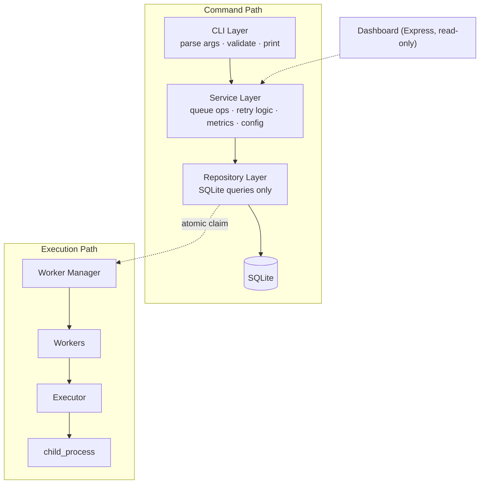
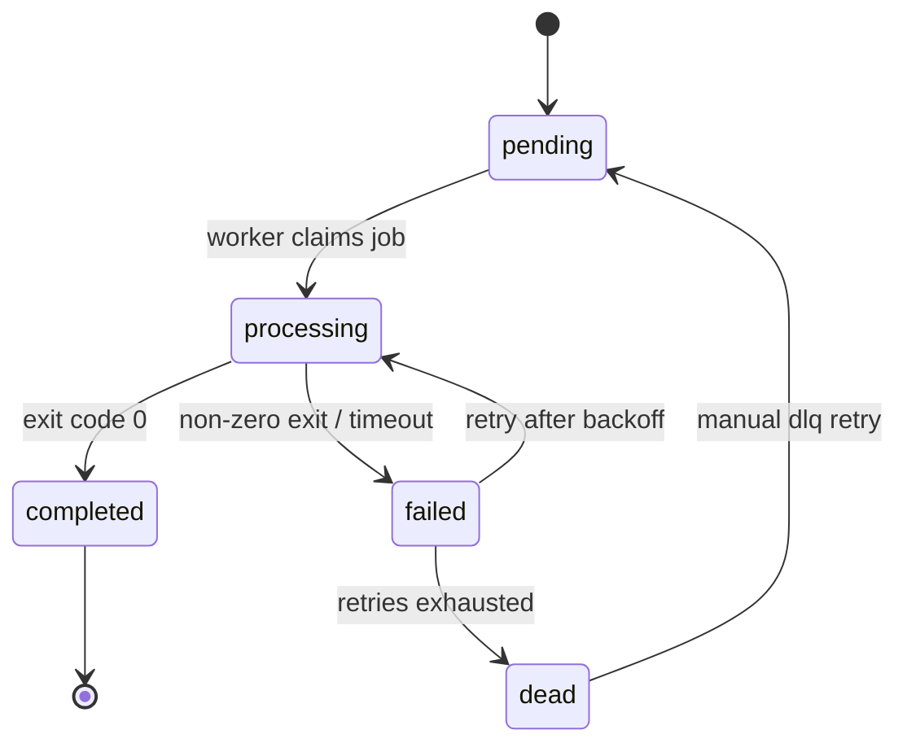

# QueueCTL

A CLI-based background job queue system, built the way production job processors actually work — not a REST API wrapper.

Producers enqueue jobs. Independent worker processes claim and execute them concurrently. Failures retry with exponential backoff. Permanently failed jobs land in a Dead Letter Queue. Everything persists to disk and survives a restart.

```bash
queuectl enqueue '{"id":"job1","command":"echo hello"}'
queuectl worker start --count 3
queuectl status
```

---

## Table of Contents

- [Why This Exists](#why-this-exists)
- [Features](#features)
- [Architecture](#architecture)
- [Project Structure](#project-structure)
- [Installation](#installation)
- [CLI Usage](#cli-usage)
- [Job Lifecycle](#job-lifecycle)
- [Concurrency & Safe Job Claiming](#concurrency--safe-job-claiming)
- [Retry & Exponential Backoff](#retry--exponential-backoff)
- [Dead Letter Queue](#dead-letter-queue)
- [Priority Queue](#priority-queue)
- [Scheduled Jobs](#scheduled-jobs)
- [Timeout Handling](#timeout-handling)
- [Logs & Metrics](#logs--metrics)
- [Monitoring Dashboard](#monitoring-dashboard)
- [Configuration](#configuration)
- [Testing](#testing)
- [Design Decisions](#design-decisions)
- [Known Limitations](#known-limitations)
- [Demo](#demo)
- [License](#license)

---

## Why This Exists

Most take-home assignments in this space become a REST API with a `jobs` table behind it. QueueCTL deliberately doesn't — it's built to mirror how background job systems actually run in production: a **producer/consumer model** over a durable store, with workers as independent OS processes rather than in-process callbacks.

The goal was to get the primitives right — atomic claiming, backoff, DLQ, graceful shutdown — before adding anything else.

## Features

### Core

| Feature | Description |
|---|---|
| CLI queue management | Full lifecycle control via `commander.js` |
| Persistent storage | SQLite (`better-sqlite3`), survives restarts |
| Concurrent workers | Multiple worker processes, no duplicate execution |
| Atomic job claiming | Transaction-scoped claim to prevent race conditions |
| Command execution | Jobs run as real OS commands via `child_process` |
| Automatic retries | Configurable max retries per job |
| Exponential backoff | `delay = backoff_base ^ attempts` seconds |
| Dead Letter Queue | Permanently failed jobs isolated and re-queueable |
| Runtime configuration | `max-retries`, `backoff-base` stored in SQLite, no hardcoding |
| Graceful shutdown | Workers finish in-flight jobs before exiting on `SIGINT` |

### Bonus

| Feature | Description |
|---|---|
| Job priority | `priority DESC, created_at ASC` — higher priority runs first, FIFO within a tier |
| Scheduled / delayed jobs | `--run-at` sets an execution floor via `next_run_at` |
| Timeout handling | Long-running jobs are killed and routed into the retry path |
| Output/error logging | Per-job stdout/stderr captured and queryable |
| Metrics | Success rate, average attempts, per-state counts |
| Read-only dashboard | Live view of jobs, states, and metrics — CLI stays the only control plane |

## Architecture

QueueCTL is layered so that each piece has exactly one job. Nothing above the Repository layer touches SQLite directly, and nothing below the Service layer contains business logic.



**CLI Layer** — parses commands, validates arguments, prints output. No business logic.

**Service Layer** — owns queue operations, retry/backoff logic, metrics calculation, and config handling.

**Repository Layer** — database queries and persistence only. No decisions made here.

**Worker Layer** — claims jobs, executes commands, manages job lifecycle end to end.

**Dashboard** — reads through the existing Service layer. Zero duplicated logic, zero write paths. The CLI remains the only way to mutate queue state.

## Project Structure

```
src/
├── cli/
│   ├── index.js              # command definitions, arg parsing
│   └── parseJobPayload.js    # JSON + flag-based payload parsing
├── database/
│   ├── connection.js
│   └── init.js
├── repositories/
│   ├── jobRepository.js
│   └── configRepository.js
├── services/
│   ├── queueService.js
│   ├── configService.js
│   ├── logService.js
│   └── metricsService.js
├── workers/
│   ├── executor.js
│   ├── worker.js
│   └── workerManager.js
└── dashboard/
    ├── server.js
    └── public/
        ├── index.html
        ├── style.css
        └── app.js

tests/
```

## Installation

```bash
git clone https://github.com/Bhumica-jaiswal/QueueCTL.git
cd QueueCTL
npm install
```

Verify the CLI is wired up:

```bash
npm run queuectl -- --help
```

## CLI Usage

### Enqueue a Job

Standard JSON (macOS/Linux):

```bash
npm run queuectl -- enqueue '{"id":"job1","command":"echo hello"}'
```

Flag-based (Windows-friendly — PowerShell mangles inline JSON quoting):

```bash
npm run queuectl -- enqueue --id job1 --command "echo hello"
```

Stored record:

```json
{
  "id": "job1",
  "command": "echo hello",
  "state": "pending",
  "attempts": 0,
  "max_retries": 3
}
```

Validation is enforced at the parser level — missing `id`, missing `command`, negative `max_retries`, and duplicate IDs are all rejected with a clear error rather than failing silently downstream.

### Start Workers

```bash
npm run queuectl -- worker start --count 3
```

```
Worker 1 ---> job1
Worker 2 ---> job2
Worker 3 ---> job3
```

Each job is claimed atomically inside a database transaction, so no two workers can ever pick up the same job.

### List & Status

```bash
npm run queuectl -- list --state pending
npm run queuectl -- status
```

Valid states: `pending`, `processing`, `completed`, `failed`, `dead`.

## Job Lifecycle



## Concurrency & Safe Job Claiming

The core race condition in any multi-worker queue is two workers grabbing the same job. QueueCTL solves this with a transaction-scoped claim:

```
BEGIN TRANSACTION
  find next executable job (respects priority + next_run_at)
  mark it 'processing' immediately
COMMIT
-- execution happens outside the transaction
```

This turns "find job → claim job" into a single atomic operation instead of two separate steps that could interleave across workers.

## Retry & Exponential Backoff

```
delay = backoff_base ^ attempts   (seconds)
```

With `backoff_base = 2`:

| Attempt | Retry delay |
|---|---|
| 1 | 2s |
| 2 | 4s |
| 3 | 8s |

Once `max_retries` is exhausted, the job moves to `dead` and stops being picked up by workers.

## Dead Letter Queue

```bash
npm run queuectl -- dlq list
npm run queuectl -- dlq retry job1
```

Retrying a dead job resets `state` to `pending`, clears `attempts` and `error`, and makes it executable again — it re-enters the normal claim/execute/retry path rather than getting special treatment.

## Priority Queue

```bash
npm run queuectl -- enqueue --id urgent --command "echo important" --priority 10
```

Claim order:

```sql
ORDER BY priority DESC, created_at ASC
```

Higher priority executes first; equal priority falls back to FIFO.

## Scheduled Jobs

```bash
npm run queuectl -- enqueue --id future-job --command "echo later" --run-at "<timestamp>"
```

Implemented by reusing `next_run_at` as an execution floor rather than adding a parallel scheduling mechanism — normal jobs get `next_run_at = now`, scheduled jobs get `next_run_at = run_at`. Workers simply never claim a job before its `next_run_at` arrives.

## Timeout Handling

```bash
npm run queuectl -- enqueue --id slow-job --command "long-running-command" --timeout 5
```

If execution exceeds the timeout: the process is killed, the job is marked `failed`, and it flows through the existing retry mechanism — no separate timeout-handling path was built.

## Logs & Metrics

```bash
npm run queuectl -- logs job1
```

```
Job: job1
State: completed
Output: hello
Error: None
```

```bash
npm run queuectl -- metrics
```

```
Total Jobs: 10
Completed: 8
Failed: 1
Dead: 1
Success Rate: 80%
Average Attempts: 1.3
```

## Monitoring Dashboard

```bash
npm run queuectl -- dashboard
# http://localhost:3000
```

The dashboard is intentionally **read-only** — it reads through the same Service layer as the CLI (`GET /api/metrics`, `GET /api/jobs`, `GET /api/jobs/:id`), with zero business logic of its own and no write path. Every mutation still goes through the CLI.

**Overview — live metrics and job table:**


**Job detail — command, output, and error inspection:**


## Configuration

```bash
npm run queuectl -- config set max-retries 5
npm run queuectl -- config set backoff-base 2
```

Config is stored in SQLite, not hardcoded — `max-retries` and `backoff-base` can be changed at runtime without touching code.

## Testing

```bash
npm test
```

Coverage spans repositories, services, worker execution, and CLI parsing, with particular attention to the scenarios that actually matter for a queue system:

- Successful execution end-to-end (`pending → processing → completed`)
- Invalid command handling
- Retry with correct exponential backoff timing
- Movement into the DLQ after retries are exhausted
- Multiple workers claiming jobs with **no duplicate execution**
- Persistence across process restarts

## Design Decisions

**SQLite over a database server.** QueueCTL is a standalone CLI tool, not a service — SQLite gives persistence and transaction support with zero external infrastructure, which fits the scope.

**Atomic claiming over optimistic locking.** Given the queue is the only thing being coordinated across workers, a transaction-scoped claim was simpler and more predictable than retry-on-conflict optimistic locking.

**Reusing `next_run_at` for both retry backoff and scheduling**, instead of building a separate scheduler. One field, one code path, fewer places for a bug to hide.

**Graceful shutdown.**

```
SIGINT received → stop accepting new jobs → finish in-flight jobs → exit
```

## Known Limitations

This is scoped deliberately, not accidentally — the trade-offs below were left out to keep the system lightweight rather than because they were missed:

- **Single-machine scope.** There's no worker heartbeat or visibility-timeout mechanism, so a hard machine/process crash mid-job isn't currently detected or recovered from automatically — that's the standard mechanism distributed queues (SQS, Celery, etc.) use, and it's outside this project's scope.
- **SQLite write concurrency.** Fine for the target use case (a handful of local workers), but SQLite's single-writer model would become a bottleneck at higher worker counts than this is designed for.
- **No auth on the dashboard.** It's built for local/dev use only; it wasn't designed to be exposed publicly as-is.

## Demo

📹 Demo video: `<add link here>`

## License

MIT — see [LICENSE](LICENSE).

## Author

Built for a Backend Developer Internship Assignment, focused on getting core queue primitives (atomic claiming, backoff, DLQ, graceful shutdown) right before adding anything else.