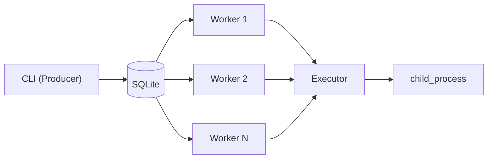
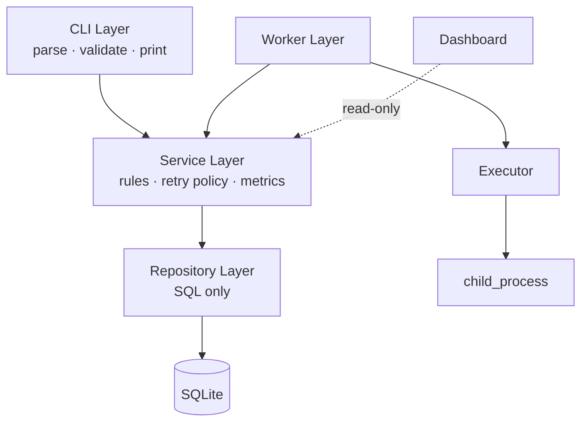
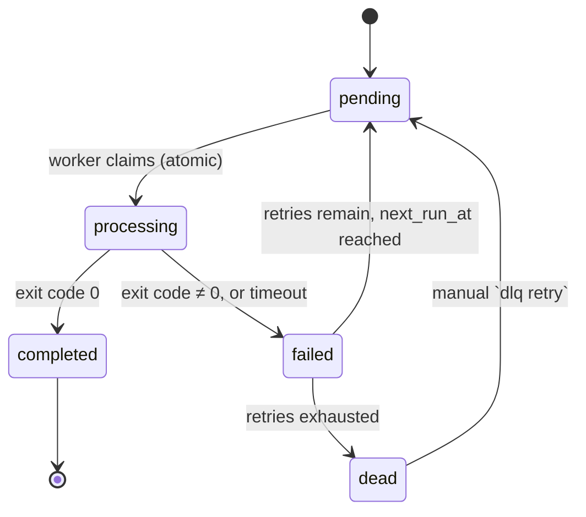

# QueueCTL — Design Document

This document explains the internal design of QueueCTL: why it's built the way it is, what alternatives were considered and rejected, and where the current design is known to be fragile. It assumes you've already read the [README](README.md) for setup and CLI usage — this doc is about reasoning, not operation.

---

## 1. System Model

QueueCTL is a single-machine producer/consumer queue. The CLI is the only producer. Worker processes are the only consumers. SQLite is the shared state between them — there is no in-memory queue and no message broker; every coordination decision is made through the database.



This is a deliberate simplification relative to systems like SQS or Redis-backed queues (Celery, BullMQ): there's no separate broker process, no network hop between producer and consumer, and no distributed consensus problem. The tradeoff is explicit — see [§8](#8-what-this-design-explicitly-does-not-solve).

---

## 2. Layering, and Why It's Enforced This Strictly



The rule enforced across all four layers: **each layer only talks to the one directly below it, and only the Service layer is allowed to make decisions.**

Why this matters in practice, not just as a diagram:

- The **Repository layer never decides anything** — it doesn't know what "retryable" means or what a valid priority is. It just runs the query it's given. This means if the retry policy changes (say, backoff becomes linear instead of exponential), exactly one file changes — `queueService.js` — and nothing in the repository or CLI needs to move.
- The **Dashboard reads through the Service layer**, not the Repository layer directly. This was a specific choice: if the dashboard queried the repository directly, metrics logic (success rate, average attempts) would need to be duplicated or the dashboard would drift from what the CLI reports. Going through the same service guarantees `queuectl metrics` and the dashboard's metrics cards can never disagree.
- The **CLI layer has no business logic**, including validation logic beyond argument shape. Field-level validation (missing `id`, negative `max_retries`) happens in `parseJobPayload` / the service layer, not in the command handler — so the same validation applies whether a job comes in via JSON or via flags.

---

## 3. Data Model

### `jobs` table

| Field | Purpose | Design note |
|---|---|---|
| `id` | Unique job identifier | Caller-supplied, not auto-generated — this lets producers make enqueue idempotent by re-using a known ID |
| `command` | Shell command to execute | Executed via `child_process`, not `eval`'d — no shell string interpolation of untrusted input beyond the command itself |
| `state` | `pending` \| `processing` \| `completed` \| `failed` \| `dead` | See [§4](#4-job-lifecycle) |
| `attempts` | Count of execution attempts so far | Incremented on every execution attempt, not just failures |
| `max_retries` | Retry ceiling | Per-job, not global — allows some jobs to be more retry-tolerant than others |
| `priority` | Claim ordering | Higher claims first; see [§6](#6-priority-ordering) |
| `next_run_at` | Earliest legal claim time | Dual-purpose — see below |
| `timeout` | Max execution duration | Enforced by the executor, not the OS `timeout` command, so behavior is consistent across platforms |
| `output` / `error` | Captured stdout/stderr | Stored per-job for the `logs` command and dashboard detail view |
| `created_at` / `updated_at` | Timestamps | `created_at` is the FIFO tiebreaker for equal-priority jobs |

**Why `next_run_at` does double duty for both retry backoff and scheduled jobs:** these are the same problem — "don't claim this job before time T" — just with different sources for T. Retry sets `T = now + backoff_delay`; scheduling sets `T = user-supplied run_at`. Giving them separate fields and separate claim-query branches would mean two code paths that need to stay in sync, for a distinction the worker doesn't actually need to know about at claim time. One field, one `WHERE next_run_at <= now()` clause, one code path.

### `config` table

Simple key/value (`max-retries`, `backoff-base`). The alternative — a config file read at startup — was rejected because it would mean workers running long-lived processes wouldn't pick up a config change without a restart. Reading config from SQLite means `config set` takes effect for the next claim cycle, not the next deploy.

---

## 4. Job Lifecycle



Note the `failed → pending` transition rather than `failed → processing` directly: a retried job goes back through the same claim path as a brand-new job, rather than a special "resume" path. This was intentional — it means there is exactly one way a job ever becomes `processing`, which is the atomic claim query described in §5. No second code path exists that could bypass that safety check.

---

## 5. Concurrency: The Atomic Claim

### The problem

With N workers polling the same table, the naive approach —

```sql
SELECT * FROM jobs WHERE state = 'pending' ORDER BY priority DESC LIMIT 1;
-- (in application code) --
UPDATE jobs SET state = 'processing' WHERE id = ?;
```

— has a race window between the `SELECT` and the `UPDATE`. Two workers can both `SELECT` the same row before either has run its `UPDATE`. This is not a hypothetical: with `worker start --count 3` and a handful of pending jobs, it reproduces very quickly.

### The fix

The claim happens as a single atomic statement inside a transaction, so "find" and "reserve" cannot be observed as two separate steps by another worker:

```sql
BEGIN IMMEDIATE;

UPDATE jobs
SET state = 'processing', updated_at = CURRENT_TIMESTAMP
WHERE id = (
  SELECT id FROM jobs
  WHERE state = 'pending'
     OR (state = 'failed' AND next_run_at <= CURRENT_TIMESTAMP)
  ORDER BY priority DESC, created_at ASC
  LIMIT 1
)
RETURNING *;

COMMIT;
```

`BEGIN IMMEDIATE` (rather than a deferred transaction) matters here — it acquires SQLite's write lock at the start of the transaction rather than at the first write, which closes the same race at the SQLite locking level rather than relying only on the subquery's atomicity. Actual execution of the command happens **outside** this transaction, after commit — holding a job "processing" for the duration of a potentially slow command inside an open transaction would block every other worker's claim attempt on SQLite's single-writer lock.

### Why not optimistic locking instead

An alternative design would be optimistic: read a job with a `version` column, attempt an `UPDATE ... WHERE id = ? AND version = ?`, and retry the read if the update affected zero rows. This is the standard approach for high-contention distributed systems, but it was rejected here for a simpler reason: SQLite is already single-writer. There's no scenario where two workers' `UPDATE`s can both succeed simultaneously, so optimistic locking would add a retry loop to solve a problem the database already solves by default. The atomic `UPDATE ... WHERE id = (SELECT ...)` pattern gets the same guarantee in one round trip instead of two.

---

## 6. Priority Ordering

```sql
ORDER BY priority DESC, created_at ASC
```

Priority is a plain integer with no reserved range — this was a deliberate simplification over something like a fixed enum (`low`/`normal`/`high`), because it lets a caller insert a job "between" two existing priority levels without a schema change (e.g., `priority 7` between `5` and `10`). The cost is that there's no validation preventing priority inflation (every producer marking their jobs `priority 999`) — that's a policy problem, not something the queue mechanism itself can solve, and is left to callers.

---

## 7. Retry, Backoff, and the Dead Letter Queue

Backoff: `delay = backoff_base ^ attempts` seconds, stored back into `next_run_at` on each failure. Exponential rather than fixed-interval backoff was chosen because the failure modes this queue is likely to see (a flaky downstream command, a transient resource contention issue) tend to clear over increasing timescales rather than a fixed one — retrying a genuinely broken command every 2 seconds for 3 attempts wastes worker cycles without meaningfully improving the odds of success.

DLQ retry (`dlq retry <id>`) resets `state → pending`, `attempts → 0`, clears `error`, and — critically — re-enters the job through the **same** claim path as any other pending job, rather than a special "force execute" path. This means a job coming out of the DLQ gets exactly the same atomicity and retry guarantees as a fresh job; there's no code path where a DLQ retry could bypass the claim lock.

---

## 8. What This Design Explicitly Does Not Solve

Being upfront about these is more useful than leaving them implicit — a reviewer reading the code will find these gaps regardless, so it's better they're documented as conscious tradeoffs than discovered as oversights.

**Worker crash mid-execution.** If a worker process is killed (not shut down gracefully) while a job is `processing`, that job stays `processing` forever — nothing currently re-claims it. Production distributed queues solve this with a **visibility timeout**: a claimed job that hasn't reported completion within some window is assumed abandoned and returned to `pending`. QueueCTL doesn't implement this. For a single-machine tool where worker crashes are rare and observable, this was judged an acceptable gap rather than a required feature — but it's the first thing that would need to be added before this design could be trusted across multiple machines or with untrusted/long-running jobs.

**No distributed locking.** The atomic claim query relies on SQLite being the single point of coordination. This design does not extend to multiple machines sharing a queue — SQLite is not built for concurrent writers across a network filesystem, and there's no leader election or distributed lock manager here. Scaling this beyond one machine would mean swapping SQLite for something like Postgres with `SELECT ... FOR UPDATE SKIP LOCKED`, or moving to a dedicated broker entirely.

**No backpressure on enqueue.** A producer can enqueue jobs faster than workers can drain them indefinitely; nothing throttles the CLI. For a local tool this is a non-issue, but it's a real gap in any design that expects sustained high throughput.

**Dashboard has no auth.** It's built for local/dev use — binding it to `0.0.0.0` or exposing it publicly as-is would leak job commands and output to anyone who can reach the port.

---

## 9. Summary

The core commitment of this design is: **every state transition a job goes through has exactly one code path.** There's one way to become `processing` (the atomic claim), one way to retry (through the normal claim path, whether the retry came from a backoff or a DLQ `retry` command), and one way to read state (through the Service layer, whether the reader is the CLI or the dashboard). That constraint is what makes the concurrency guarantees in §5 actually hold — a second, informal path into any of these states would quietly reopen the race conditions the design is built to close.

What's left out — heartbeats, distributed locking, backpressure — isn't missing by accident. It's left out because none of it is needed for a single-machine tool, and adding it would mean carrying complexity the current use case doesn't call for.